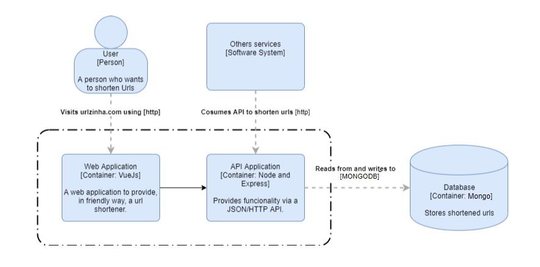

# Urlzinha
  This is Urlzinha, a api and web service to shorten urls. Urlzinha in portuguese mean's something like 'small url'

## Architecture of the solution

The solution is composed by a Web Application created using [Vue Js](https://vuejs.org) and a Web Service Application created using [Express](https://vuejs.org)

### C4 Model Container Diagram



## Setup

1. Node/NPM approach:

    #### Dependencies:
    - NodeJS
    - Npm    
    
    Uses `npm install` to install web app and api, then run `npm start`. This approach will use a redis instance that is available on [RedisLabs](https://redislabs.com) configurad by default. Web app on the port: 8080 and Api on 3000

2. Docker approach:

    #### Dependencies:
    - Docker 

    Run `docker-compose up` to build, run and let available the Web app on the port 8080 and Api on 3000 and behind the scene a Redis instance. 

## Usage

1. Use [web application](http://localhost:8080) 

2. Use [Swagger](http://localhost:3000/api-docs) docs to try out or as a reference to implement the consumers of the API


## Help
### Docker commands
```sh
docker build -f Dockerfile-Api -t urlzinha-api .
docker image rm urlzinha-api

docker run -p 3000:8080 -d urlzinha-api

docker build --build-arg VUE_APP_API_URL=http://localhost:3000 -f Dockerfile-Web -t urlzinha-web .
docker image rm urlzinha-web

docker run -it -p 8080:80 --rm --name urlzinha-web-1 urlzinha-web

docker container stop <container id>  
docker container rm <container id>

docker run -d -p 6379:6379 -i -t redis:5.0.6-alpine
```
